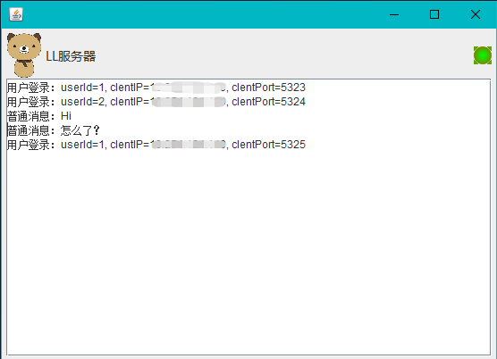
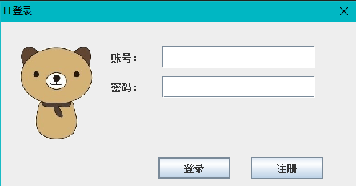
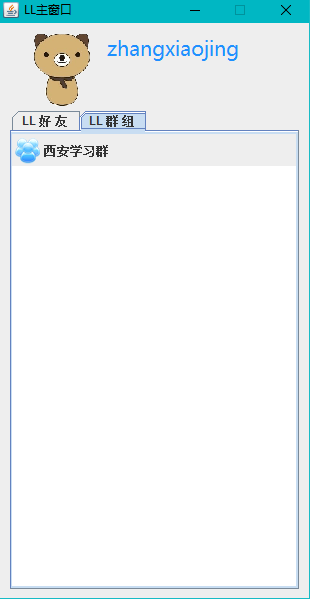
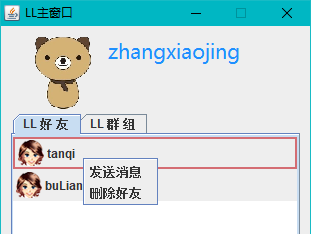
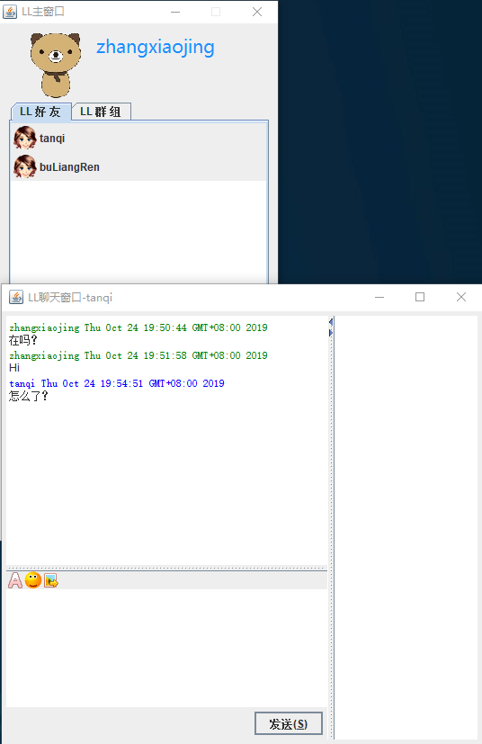
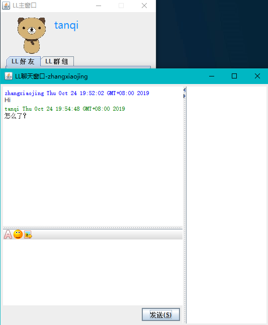

MSN532(Windows Live Messenger) 一款由Java开发的即时聊天软件。同一电脑可以登录多个聊天客户端，有好友、群组的概念，是Soket网络编程一个简单的应用，功能简单、用于学习交流。

技术栈：Java Swing + Hibernate + Mysql

功能：

- 登录
- 注册
- 添加好友
- 发送/接受消息
- 新建群组
- 加入群组
- 群聊

#### 快速开始

- 启动服务端
  
  运行```msn532-server\src\main\java\cn\edu\main\Server.java```启动服务端
  
   
- 启动客户端
  
1. 运行```msn532-client\src\main\java\cn\edu\main\Main.java```启动客户端

   
   
   输入用户名密码后，跳转主页面：
   
   
   
   右键好友名称，点击“发送消息”：
   
   
   
   弹出聊天面板，可进行聊天：
   
   
   
   如果对方也在线，在主面板的右上角会提示有新消息，点开后可查看消息
   
   
   
#### 问题探讨

本项目仅可用于学习，源码不授权任何商业行为，欢迎大家在issues里探讨，改进！